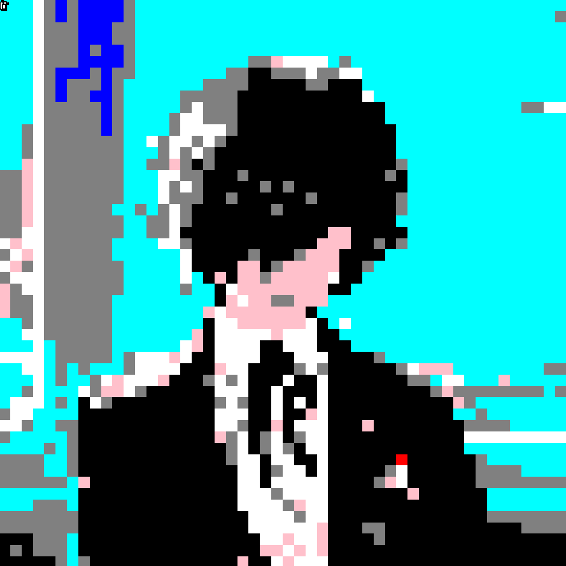

# 🤖 Karel Pixel Art Generator
**My Final Project for Stanford Code in Place.**

This project uses **Metaprogramming** in Python to convert any image into Pixel Art using Karel the Robot. Instead of hardcoding Karel's movements, a Python script reads an image and writes the Karel code automatically!


## 🌟 How does it work?
1. The `generador.py` script reads a source image (e.g., `persona3.png`).
2. It resizes the image into a 50x50 grid and compares each pixel with Karel's built-in 13-color palette using the Euclidean color distance formula.
3. The Python program **automatically writes** a new file (`karel_dibuja_mi_foto.py`) containing over 5,000 exact instructions (`move`, `paint_corner`).
4. It also automatically generates a `.w` world file to ensure the canvas size is correct.
5. By running the generated file, Karel draws the image line by line on a giant 50x50 canvas.

## 🚀 How to run it locally
If you want to try this on your own machine, you need to install the required libraries:

```bash
pip install Pillow stanfordkarel
```

Then, follow these steps:
1. Place any image in the project folder and update the filename at the bottom of `generador.py`.
2. Run the generator:
```bash
python generador.py
```
3. Run the generated Karel program:
```bash
python karel_dibuja_mi_foto.py
```

## 📸 Result
*(Here is Karel finishing the artwork)*



---
*Built combining the local `stanfordkarel` library and `Pillow` for image processing.*
